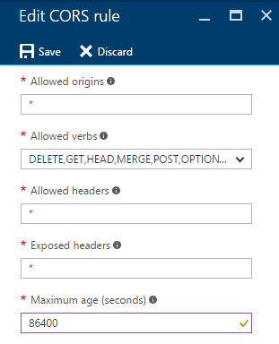

# Azure Storage JavaScript Client Library for Browsers

The copy from https://github.com/Azure/azure-storage-node#azure-storage-javascript-client-library-for-browsers
for testing purposes

Goal to create SPA to directly intarcat with BLOB without needed a WebApp

You need to setup appropritelly CORS for Azure Storage to access from JS from differnt domain.

